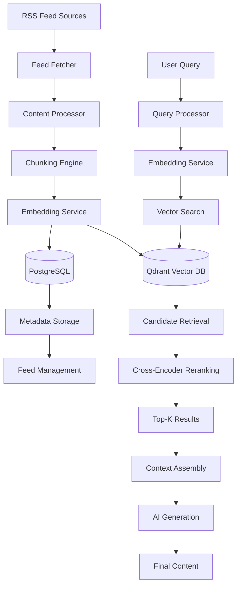

# RAG Implementation Technical Specification

## Overview

This specification outlines the implementation of a Retrieval-Augmented Generation (RAG) system for Neural Feed Studio. The RAG system will enable intelligent retrieval of relevant content from RSS feeds, replacing the current approach of passing raw feed content directly to AI models for generation.

## Requirements Summary

Based on the requirements gathering session, the following architectural decisions have been made:

- **Vector Database**: Qdrant (running on Docker)
- **Main Database**: PostgreSQL (running on Docker, replacing SQLite)
- **Embedding Model**: Ollama qwen3-embedding:4b (local inference)
- **Chunking Strategy**: Hybrid approach combining semantic chunking and recursive text splitting
- **Retrieval Strategy**: Reranking with cross-encoders for improved relevance
- **Integration Approach**: Optional mode - users can choose between RAG and raw content generation

## System Architecture



## Core Components

### 1. Content Processing Pipeline

#### Feed Ingestion
- **Input**: RSS feed URLs and update schedules
- **Process**: Fetch new content from active feeds
- **Output**: Raw article content with metadata

#### Content Chunking
- **Strategy**: Hybrid semantic + recursive splitting
- **Implementation**:
  - Primary: Split on natural boundaries (paragraphs, sections)
  - Fallback: Recursive splitting (paragraphs → sentences → words)
  - Chunk size: 512 tokens with 50-token overlap
- **Metadata preservation**: Source URL, publication date, title, chunk index

#### Embedding Generation
- **Model**: qwen3-embedding:4b via Ollama
- **Process**: Convert text chunks to 384-dimensional vectors
- **Storage**: Qdrant vector database with metadata

### 2. Retrieval System

#### Query Processing
- **Input**: User topic/query for content generation
- **Process**: Generate query embedding using same model
- **Output**: Query vector for similarity search

#### Vector Search
- **Algorithm**: Cosine similarity search in Qdrant
- **Parameters**: Top-100 candidates initially
- **Filtering**: Optional date range, source filtering

#### Reranking
- **Model**: Cross-encoder for query-chunk relevance scoring
- **Process**: Re-rank top-100 candidates to top-10 most relevant
- **Output**: Ranked chunks with relevance scores

### 3. Generation Integration

#### Context Assembly
- **Input**: Top-K relevant chunks
- **Process**: Combine chunks with source attribution
- **Output**: Structured context for AI generation

#### Mode Selection
- **RAG Mode**: Use retrieved context
- **Raw Mode**: Use original feed content approach
- **Hybrid Mode**: Combine both approaches

## Database Schema

### PostgreSQL Tables

#### content_chunks
```sql
CREATE TABLE content_chunks (
    id UUID PRIMARY KEY,
    feed_id UUID NOT NULL,
    chunk_index INTEGER NOT NULL,
    content TEXT NOT NULL,
    embedding_id VARCHAR(255),
    metadata JSONB,
    created_at TIMESTAMP DEFAULT NOW(),
    updated_at TIMESTAMP DEFAULT NOW()
);
```

#### feed_items
```sql
CREATE TABLE feed_items (
    id UUID PRIMARY KEY,
    feed_id UUID NOT NULL,
    title VARCHAR(500),
    content TEXT,
    url VARCHAR(2000),
    published_at TIMESTAMP,
    processed_at TIMESTAMP,
    chunk_count INTEGER DEFAULT 0,
    created_at TIMESTAMP DEFAULT NOW()
);
```

### Qdrant Collections

#### feed_chunks
- **Vector dimension**: 384
- **Distance metric**: Cosine
- **Payload fields**:
  - chunk_id: UUID
  - feed_id: UUID
  - content: text
  - metadata: JSON

## API Design

### New Endpoints

#### POST /api/rag/embed
- **Purpose**: Generate embeddings for content chunks
- **Input**: Array of text chunks
- **Output**: Array of embedding vectors

#### POST /api/rag/search
- **Purpose**: Retrieve relevant content chunks
- **Input**: Query string, filters, limit
- **Output**: Ranked chunks with metadata and scores

#### POST /api/rag/process-feed
- **Purpose**: Process and chunk a feed item
- **Input**: Feed item data
- **Output**: Processing status and chunk count

#### GET /api/rag/stats
- **Purpose**: Get RAG system statistics
- **Output**: Chunk count, embedding status, search metrics

## Implementation Phases

### Phase 1: Infrastructure Setup (Week 1-2)
- [ ] Set up Docker Compose with Qdrant and PostgreSQL
- [ ] Create database migration scripts
- [ ] Set up Ollama with qwen2:0.5b model
- [ ] Create basic vector database client

### Phase 2: Content Processing Pipeline (Week 3-4)
- [ ] Implement content chunking service
- [ ] Create embedding generation service
- [ ] Build feed processing worker
- [ ] Add chunk storage and indexing

### Phase 3: Retrieval System (Week 5-6)
- [ ] Implement vector search functionality
- [ ] Add cross-encoder reranking
- [ ] Create query processing pipeline
- [ ] Build context assembly logic

### Phase 4: UI Integration (Week 7-8)
- [ ] Add RAG mode toggle in content generation UI
- [ ] Create settings for RAG configuration
- [ ] Add retrieval results preview
- [ ] Implement mode selection persistence

### Phase 5: Testing & Optimization (Week 9-10)
- [ ] Performance testing and optimization
- [ ] Accuracy evaluation with test queries
- [ ] Memory usage optimization
- [ ] Error handling and monitoring

## Technical Considerations

### Performance Optimization
- **Batch Processing**: Process multiple chunks simultaneously
- **Caching**: Leverage Qdrant built-in caching for vector queries and embeddings
- **Indexing**: Optimize Qdrant indexing for faster search
- **Memory Management**: Stream processing for large feeds

### Error Handling
- **Embedding Failures**: Fallback to alternative chunking
- **Vector DB Issues**: Graceful degradation to raw content mode
- **Model Loading**: Retry logic for Ollama service
- **Rate Limiting**: Handle API limits for embedding generation

### Monitoring & Observability
- **Metrics**: Query latency, retrieval accuracy, chunk processing time
- **Logging**: Structured logs for debugging
- **Health Checks**: Service availability monitoring
- **Usage Analytics**: Track RAG vs raw mode usage

## Migration Strategy

### Database Migration
1. Export existing SQLite data
2. Transform data to new PostgreSQL schema
3. Re-process existing feed content through RAG pipeline
4. Validate data integrity

### Feature Flag Implementation
- Use feature flags to enable RAG mode per user
- Gradual rollout with A/B testing
- Easy rollback capability

## Success Metrics

### Quantitative Metrics
- **Retrieval Accuracy**: >80% relevant results in top-5
- **Generation Quality**: User satisfaction scores
- **Performance**: <2s average query time
- **Coverage**: >90% of feed content properly chunked

### Qualitative Metrics
- **User Experience**: Ease of switching between modes
- **Content Quality**: Improved source attribution
- **System Reliability**: <1% error rate in production

## Risk Assessment

### High Risk
- **Model Performance**: qwen2:0.5b may not provide sufficient embedding quality
- **Infrastructure Complexity**: Docker setup increases deployment complexity
- **Data Migration**: Potential data loss during SQLite → PostgreSQL migration

### Mitigation Strategies
- **Model Evaluation**: A/B test with different embedding models
- **Infrastructure**: Provide clear Docker setup documentation
- **Migration**: Comprehensive backup and rollback procedures

## Future Enhancements

### Short Term (3-6 months)
- Multi-language support for embeddings
- Advanced filtering (date ranges, source types)
- Query expansion for better retrieval

### Long Term (6-12 months)
- Custom fine-tuned embedding models
- Multi-modal retrieval (text + images)
- Conversational RAG with memory
- Automated content summarization

## Conclusion

This RAG implementation will significantly enhance Neural Feed Studio's content generation capabilities by providing intelligent, contextually relevant information retrieval from RSS feeds. The modular design allows for gradual rollout and easy maintenance, while the optional mode approach ensures backward compatibility with existing workflows.